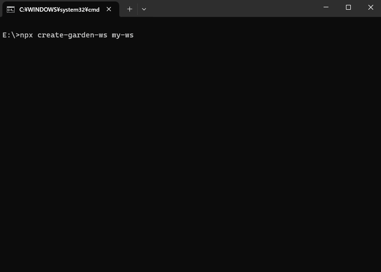

# Create GARDEN Workspace


Create GARDEN workspaces with no build configuration.

- [Creating an Workspace](#creating-an-workspace) – How to create a new workspace.

Create GARDEN Workspace works on macOS, Windows, and Linux.<br>
If you have questions or need help, please ask in [GARDEN Contact](https://open-garden.github.io/garden/ja/contact/).

## Quick Overview

```sh
npx create-garden-ws my-ws
cd my-ws
```

If you've previously installed `create-garden-ws` globally via `npm install -g create-garden-ws`, we recommend you uninstall the package using `npm uninstall -g create-garden-ws` to ensure that npx always uses the latest version.

<p align='center'>

</p>

## Creating an Workspace

**You’ll need to have Node 16.0.0 or later version on your local development machine** (but it’s not required on the server). We recommend using the latest LTS version. You can use [nvm](https://github.com/creationix/nvm#installation) (macOS/Linux) or [nvm-windows](https://github.com/coreybutler/nvm-windows#node-version-manager-nvm-for-windows) to switch Node versions between different projects.

To create a new workspace, you may choose one of the following methods:

### Create a new folder 

#### npx 

```sh
npx create-garden-ws my-ws
```

_([npx](https://medium.com/@maybekatz/introducing-npx-an-npm-package-runner-55f7d4bd282b) is a package runner tool that comes with npm 5.2+ and higher, see [instructions for older npm versions](https://gist.github.com/gaearon/4064d3c23a77c74a3614c498a8bb1c5f))_

#### npm

```sh
npm init garden-ws my-ws
```

_`npm init <initializer>` is available in npm 6+_

### Create with an existing folder

#### npx

```sh
cd my-ws
npx create-garden-ws . --init-ws
```

#### npm

```sh
cd my-ws
npm init garden-ws . --init-ws
```

It will create a directory called `my-ws` inside the current folder.<br>
Inside that directory, it will generate the initial project structure and install the transitive dependencies:

```
my-app
├── .gitignore
├── .vscode
│   ├── tasks.json
│   └── settings.json
└── src
    └─rulebase
        ├── isec.csv
        ├── make.sh
        ├── CMakeLists.txt
        ├── .generator
        │   ├── gen.sh
        │   ├── ZRBDtGeneratorCMD.py
        │   ├── ZRBStmGeneratorCMD.py
        │   └── ZRBCodeGeneratorSwicher.py
        ├── include
        │   └── RBLib.h
        └── lib
            └── libRBLib.so
```

No configuration or complicated folder structures, only the files you need to build your workspace.<br>
Once the installation is done, you can open your project folder:

```sh
cd my-ws
```

## User Guide

You can find detailed instructions on using Create GARDEN Workspace and many tips in [its documentation](https://open-garden.github.io/garden/ja/).

## License

Create GARDEN Workspace is open source software [licensed as MIT](https://github.com/ouikou/create-garden-ws/blob/main/LICENSE).